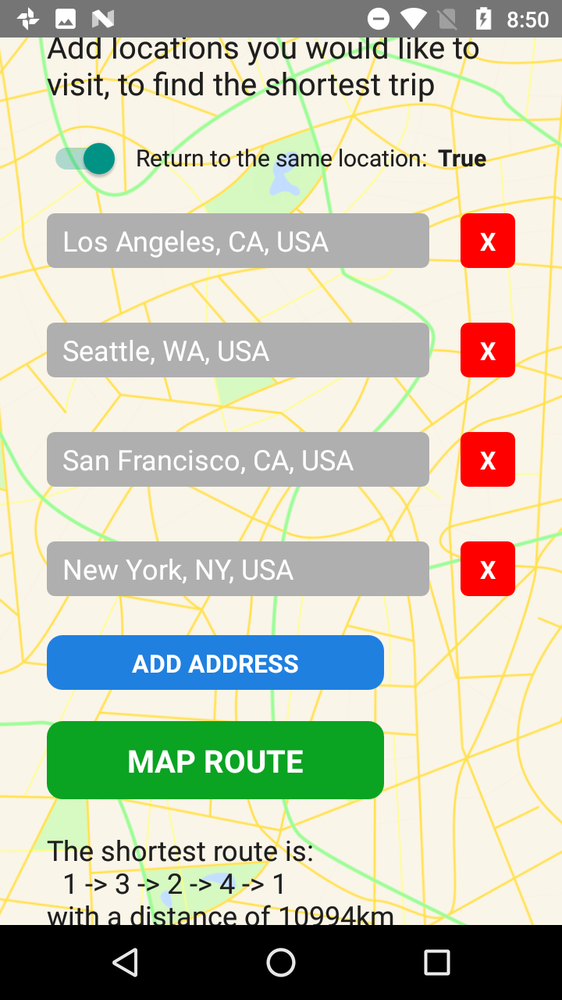

# Tour-Planner
A React-Native application to plan trips based on inputted locations

Below are some of the app screenshots:

 An example of utilizing 5 different inputs for the mapping algorithm

 A calculation of a one-way trip, using the Hamiltonian cycle algorithm

 A calculation of a round trip, using the Travelling Salesman algorithm