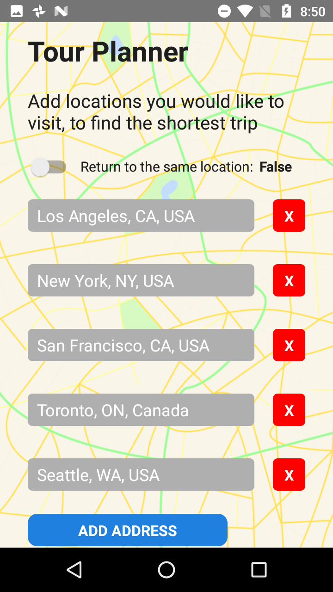
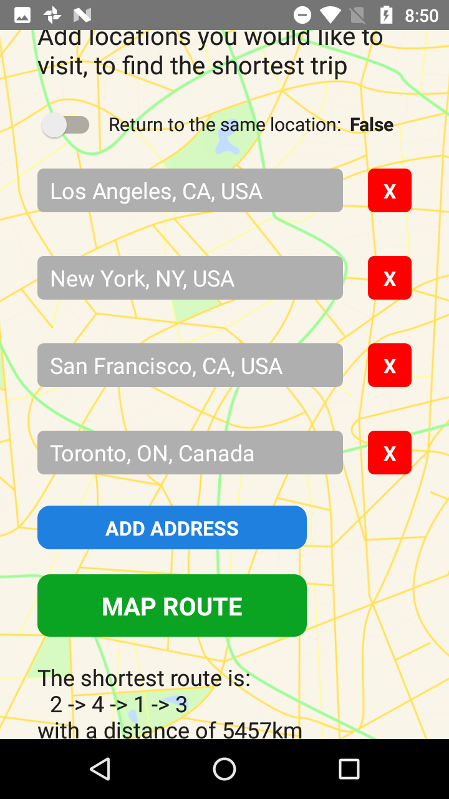

# Tour-Planner
A React-Native application to plan trips based on inputted locations

Below are some of the app screenshots:

An example of inputting 5 different locations for the planner to map using

A calculation of a one-way trip, using the Hamiltonian cycle algorithm

